# Asynchronous Risk-Aware Multi-Agent Packet Routing for Ultra-Dense LEO Satellite Networks

[](https://www.python.org/downloads/release/python-3110/)
[](https://opensource.org/licenses/MIT)
[](https://arxiv.org/abs/2025.XXXXX)
[](https://pytorch.org/)

> **Official implementation** of the paper: "Asynchronous Risk-Aware Multi-Agent Packet Routing for Ultra-Dense LEO Satellite Networks"
>
> **Authors**: Ke He, Thang X. Vu, Le He, Lisheng Fan, Symeon Chatzinotas, and Björn Ottersten
>
> 📄 **[Read Paper (PDF)](./manuscript.pdf)**

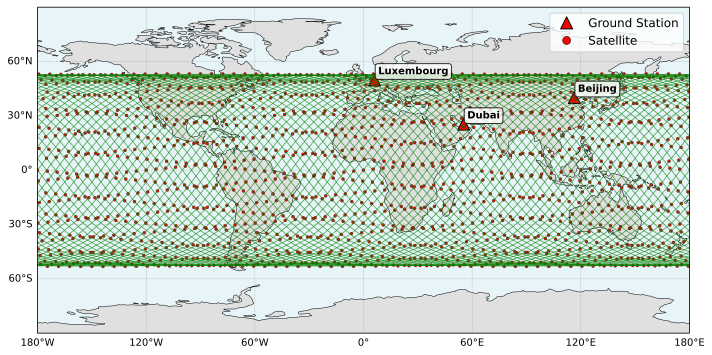

## 🌟 Overview

This repository presents **PRIMAL** (Principled Risk-aware Independent Multi-Agent Learning), a novel multi-agent deep reinforcement learning framework for packet routing in ultra-dense LEO satellite networks. Our approach addresses the unique challenges of massive scale (1584 satellites), dynamic topology, and significant propagation delays inherent in next-generation mega-constellations.

This codebase contains a light-weight even-driven simulator for LEO satellite communications used as the environment for offline training of RL agents, i.e., Multi-agent deep reinforcement learning based networking in ultra-dense LEO satellite networks.

### 🔄 Event-Driven Simulator with Native RL Integration

Our simulator seamlessly integrates deep RL training into an event-driven network simulation without artificial episode boundaries. Here's how it works:

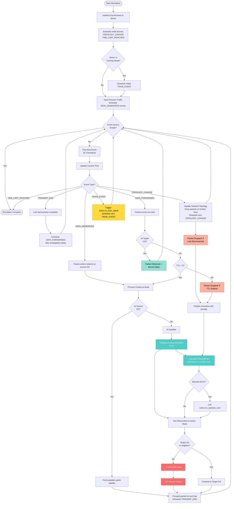

**Key Features:**

1. **🎯 Asynchronous Episodes**: Each packet forms its own episode with variable length (until delivery or drop)
2. **⚡ Event-Driven Execution**: All actions (routing decisions, transmissions, topology changes) are scheduled as timestamped events
3. **🔗 Seamless RL Integration**: 
   - `solver.route(obs, info)` → Policy makes routing decisions
   - `on_action_over(packet)` → Store experience in replay buffer when transition completes
   - `on_episode_over(packet)` → Episode termination when packet delivered/dropped
   - `on_train_signal()` → Periodic training triggered by TRAIN_EVENT (every 100ms by default)
4. **⏱️ Realistic Delays**: Queueing, transmission, and propagation delays naturally emerge from the simulation rather than 1ms artifical stepsize

### 📊 Key Results

- **70% reduction** in queuing delay (i.e. network congestion) compared to risk-oblivious baselines
- **12ms improvement** in end-to-end delay under loaded scenarios
- **5.8% CVaR violation rate** vs 75.5% for traditional approaches
- Successfully manages routing in a dense network of **1584 satellites** and **3 ground stations**

### Technical Development

Our PRIMAL framework resolves the fundamental conflict between shortest-path routing and congestion avoidance through:
- **Event-driven design**: Each satellite acts independently on its own timeline
- **Primal-dual optimization**: Principled constraint handling without manual reward engineering to avoid reward-hacking
- **Implicit Quantile Networks**: Capture full distribution of routing outcomes
- **CVaR constraints**: Direct control over worst-case performance degradation

## 📚 Citation

If you use this code in your research, please cite our related papers:

```bibtex
@INPROCEEDINGS{HeRiskAware2025,
  author={Ke He and Thang X. Vu and Le He and Lisheng Fan and Symeon Chatzinotas and Björn Ottersten},
  booktitle=under review (will update when we know the result),
  title={Asynchronous Risk-Aware Multi-Agent Packet Routing for Ultra-Dense LEO Satellite Networks},
  year={2025},
  pages={1-10},
}

@ARTICLE{HeRiskAware2024,
  author={Ke He and Thang X. Vu and Dinh Thai Hoang and Diep N. Nguyen and Symeon Chatzinotas and Björn Ottersten},
  journal={IEEE Transactions on Wireless Communications},
  title={Risk-Aware Antenna Selection for Multiuser Massive MIMO Under Incomplete CSI},
  year={2024},
  volume={23},
  number={9},
  pages={11001-11014},
}
```

## 📋 Requirements

### System Requirements
- Python 3.11+
- CUDA 11.8+ (for GPU acceleration)
- 32GB RAM (recommended for training)
- Ubuntu 20.04+ / Windows 10+ / macOS 12+

### Installation

```bash
# Clone the repository
git clone https://github.com/yourusername/risk_aware_marl.git
cd risk_aware_marl

# Create conda environment
conda create -n risk_aware_routing python=3.11
conda activate risk_aware_routing

# Install dependencies
pip install -r requirements.txt
```

#### Troubleshooting

<details>
<summary>CUDA/PyTorch issues</summary>

If you encounter CUDA compatibility issues:
```bash
# For CUDA 11.8
pip install torch torchvision torchaudio --index-url https://download.pytorch.org/whl/cu118

# For CUDA 12.1
pip install torch torchvision torchaudio --index-url https://download.pytorch.org/whl/cu121
```
</details>

<details>
<summary>Cartopy installation issues</summary>

On some systems, Cartopy may require additional dependencies:
```bash
# Ubuntu/Debian
sudo apt-get install libproj-dev proj-data proj-bin libgeos-dev

# macOS
brew install proj geos
```
</details>

## 🧠 Implemented Algorithms

### Our Contributions (PRIMAL Framework)
- **PRIMAL-CVaR** 🎯: Risk-aware routing with CVaR constraints at configurable risk levels (e.g., ε=0.25)
  - Learns full cost distribution via Implicit Quantile Networks
  - Directly constrains tail-end risks for robust performance
- **PRIMAL-Avg** 📊: Risk-neutral variant with expectation-based constraints
  - Optimizes average performance with primal-dual learning
  - Serves as ablation study for risk-awareness benefits

### Baseline Methods
- **SPF**: Dijkstra's Shortest Path First - Precomputed routing based on predictable orbital movements
- **MADQN**: Multi-agent asynchronous DQN with heuristic reward shaping [Lozano-Cuadra et al., 2025]
- **MaIQN**: Multi-agent Implicit Quantile Network (distributional but risk-oblivious)
- **MaSAC**: Multi-agent Soft Actor-Critic with maximum entropy

## 📁 Project Structure

```
risk_aware_marl/
├── sat_net/                    # Core simulation framework
│   ├── routing_env.py          # Async routing environment
│   ├── network.py              # Satellite network topology
│   ├── node.py                 # Satellite/ground station nodes
│   ├── link.py                 # Communication links
│   ├── event.py                # Event-driven scheduler
│   └── solver/                 # Routing algorithms
│       ├── primal_cvar.py      # Our risk-aware algorithm
│       ├── primal_avg.py       # Our risk-neutral algorithm
│       ├── dqn.py              # DQN baseline
│       └── spf.py              # Traditional routing
├── satnet_viewer/              # 2D visualization tool
│   ├── app.py                  # ImGui application
│   └── renderer.py             # OpenGL rendering
├── configs/                    # Configuration files
│   ├── starlink_dvbs2_*.json  # Network configurations
│   └── *.json                  # Algorithm hyperparameters
├── saved_models/               # Pre-trained models
├── figs/                       # Figures and plots
└── runs_*/                     # Experiment results

## 🚀 Quick Start

### Using Pre-trained Models

We provide pre-trained models in the `saved_models/` directory for immediate evaluation:

```bash
# Evaluate all algorithms with pre-trained models
python run_eval.py

# Generate SPF baseline results
python run_spf.py
```

### Training from Scratch

#### Single Algorithm Training
```bash
# Train Primal-CVaR (our risk-aware algorithm)
python run_train.py --solver=configs/primal_cvar.json

# Train Primal-Avg (our risk-neutral algorithm)
python run_train.py --solver=configs/primal_avg.json

# Train baseline algorithms
python run_train.py --solver=configs/dqn.json
python run_train.py --solver=configs/iqn.json
python run_train.py --solver=configs/sac.json
```

#### Distributed Training (SLURM)
```bash
# Submit training jobs to SLURM cluster
sbatch train_primal_cvar.sh
sbatch train_primal_avg.sh
sbatch train_madqn.sh
```

#### Custom Configuration
```json
// Example: configs/primal_cvar.json
{
  "risk_level": 0.25,      // CVaR risk level (0.25 = worst 25% of outcomes)
  "cost_limit": 10,        // Maximum queuing delay threshold (ms)
  "discount_reward": 0.99, // Reward discount factor
  "discount_cost": 0.97,   // Cost discount factor (lower = more myopic)
  "hidden_dim": 512,       // Neural network hidden layer size
  "num_quantiles": 64,     // Number of quantiles for IQN
  "batch_size": 2048,      // Training batch size
  "buffer_size": 300000,   // Experience replay buffer size
  "learning_rate": 1e-4
}
```

### Visualization and Analysis

#### Training Metrics
```bash
# Plot training curves (loss, reward, packet drop rate)
python plot_train.py

# Visualize specific run
python plot_train.py --run_dir=runs_train/PrimalCVaR_2025-07-22_22-10-05
```

#### Evaluation Results
```bash
# Generate comprehensive evaluation plots
python plot_eval.py source=runs_eval/<run_id>

# Plot network load distribution on world map
python plot_load.py
python plot_load_static.py

# Analyze queueing delay distribution
python plot_queueing_delay_distribution.py

# Compare algorithms
python plot_topology.py
```

#### Interactive Constellation Viewer
```bash
# Launch 2D visualization tool
python run_satnet_viewer.py

# Controls:
# - Mouse: Rotate view
# - Scroll: Zoom in/out
# - Space: Pause/resume simulation
# - R: Reset view
```

## 🎮 Interactive Visualization

Experience real-time LEO constellation dynamics with our custom 2D viewer:

```bash
python run_satnet_viewer.py
```
*This is currently used for visualizing the dynamics and we may support dynamic algorithm result visualization in the future*

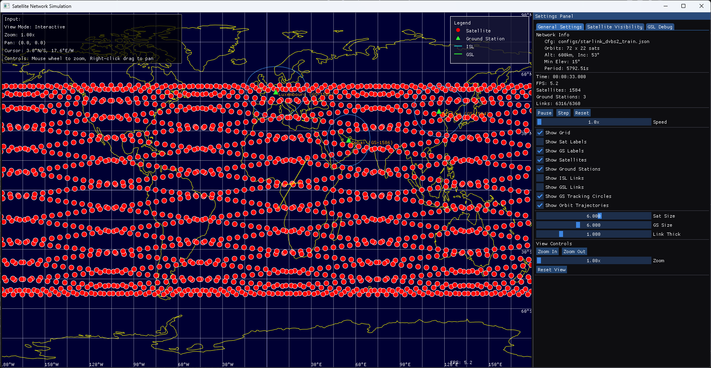

**Features:**
- Real-time satellite orbit propagation with 100ms updates
- Inter-satellite link visualization (4 ISLs per satellite)
- Ground station connectivity tracking
- Walker-Delta constellation topology display


## 📊 Experimental Results

### Performance Comparison

Our risk-aware algorithms demonstrate significant improvements over traditional and baseline RL methods:

#### Training Performance
<table>
<tr>
<td>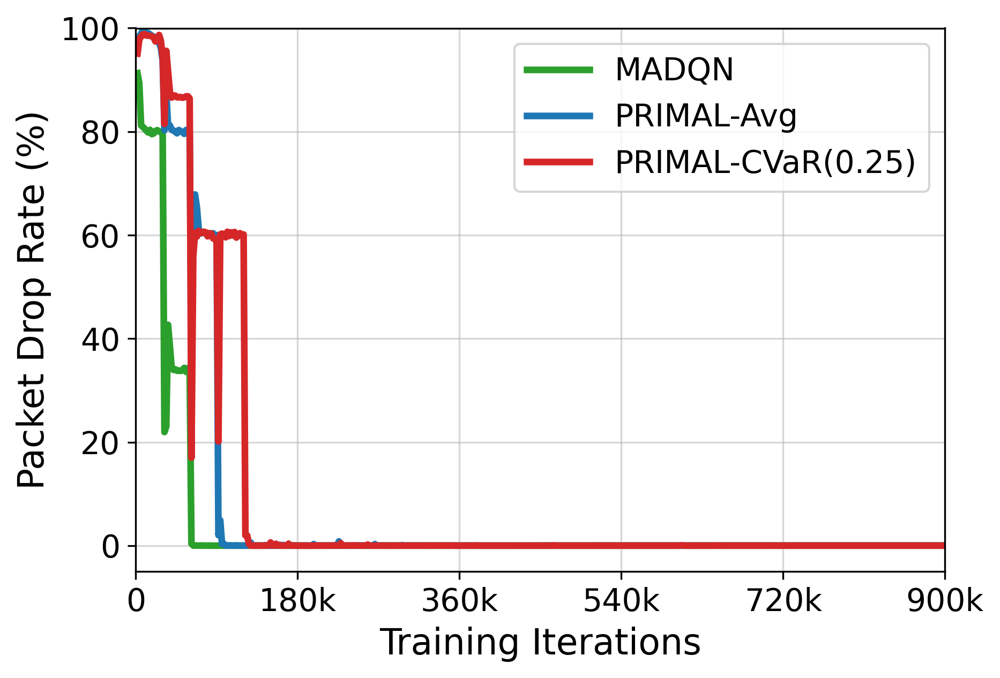</td>
<td>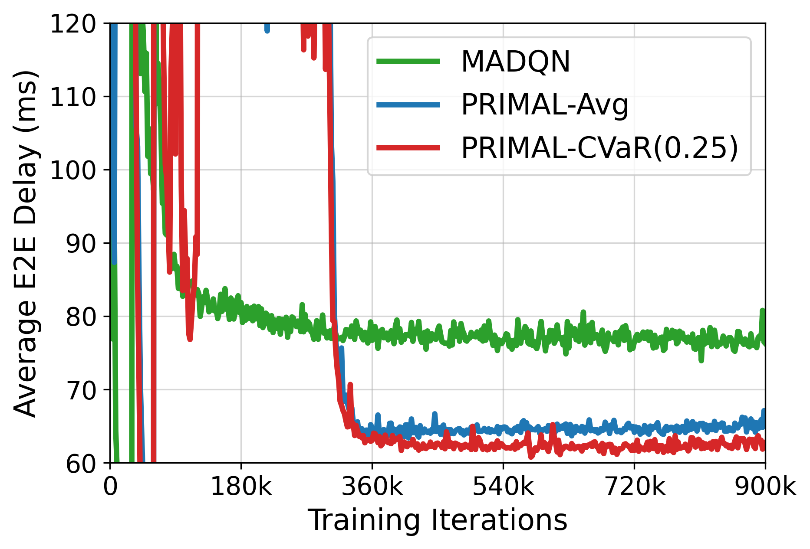</td>
</tr>
<tr>
<td align="center"><b>Packet Drop Rate</b><br>0% packet drop rate</td>
<td align="center"><b>End-to-End Delay</b><br>25% lower average delay</td>
</tr>
</table>

#### Delay Components Analysis
<table>
<tr>
<td>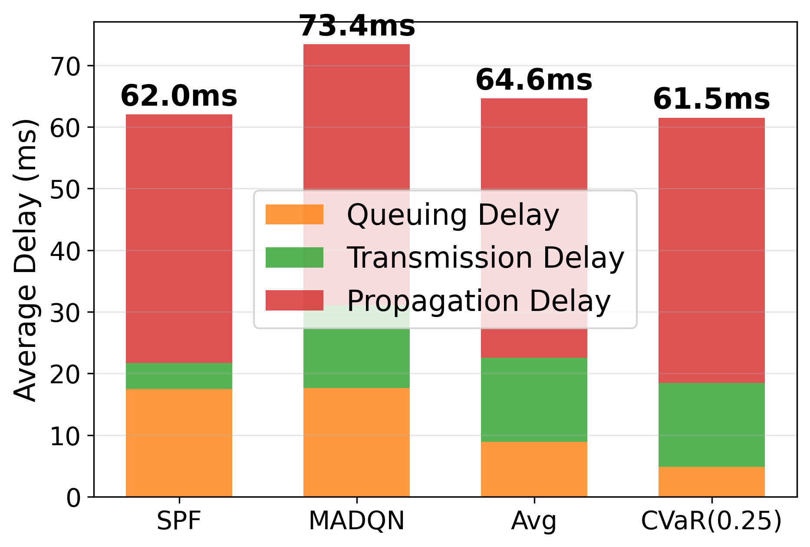</td>
<td>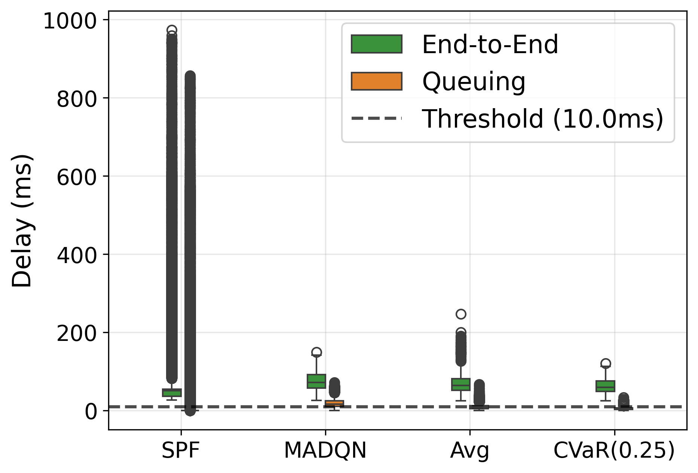</td>
</tr>
<tr>
<td align="center"><b>Breakdown of delay components showing improved queueing delay management</td>
<td align="center"><b>Statistical distribution demonstrating more consistent performance</td>
</tr>
</table>

### Load Balancing Visualization

Our algorithms achieve superior load balancing across the satellite network. Darker regions indicate higher loads or queueing delays:

The heatmaps demonstrate how different algorithms distribute network load. Our risk-aware (Primal-CVaR) and risk-myopic (Primal-Avg) methods achieve more balanced load across the satellite network, avoiding congestion hotspots that are evident in the baseline SPF and MaDQN methods. Darker regions in the figures indicate higher load or queueing delay, and our methods show a more even distribution while does not compromise on the end-to-end delay and packet delivery rate.

<table>
<tr>
<td>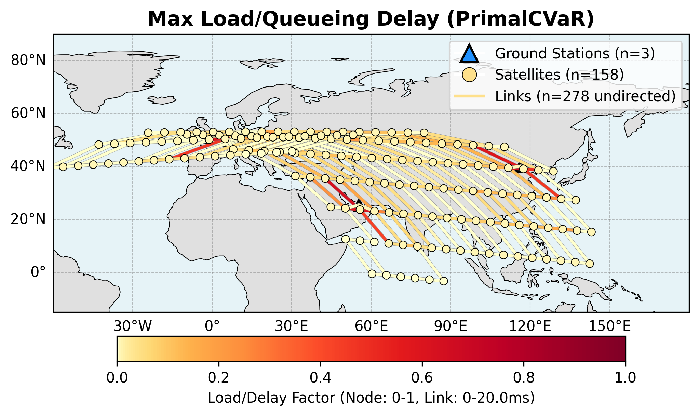</td>
<td>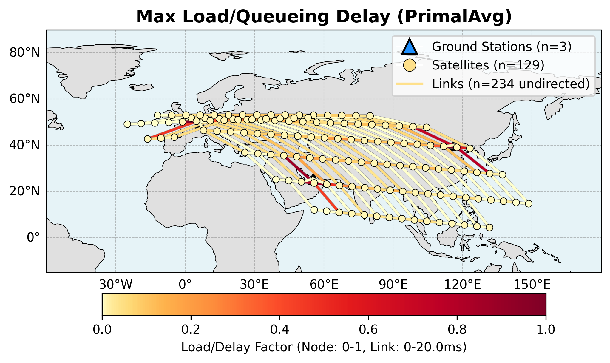</td>
</tr>
<tr>
<td align="center"><b>Primal-CVaR (Ours)</b><br>Risk-aware load distribution</td>
<td align="center"><b>Primal-Avg (Ours)</b><br>Risk-myopic traffic routing</td>
</tr>
<tr>
<td></td>
<td>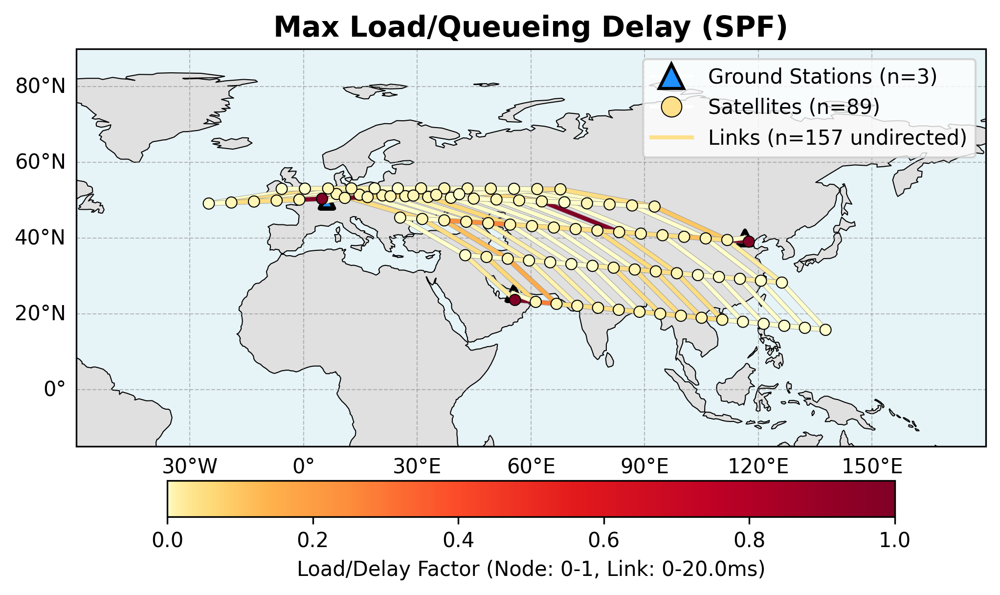</td>
</tr>
<tr>
<td align="center"><b>MaDQN Baseline</b><br>Moderate load balancing</td>
<td align="center"><b>SPF Baseline</b><br>Concentrated hotspots</td>
</tr>
</table>


### Queueing Delay Distribution

The following figures demonstrate the effectiveness of our load-balancing approach through queueing delay analysis:

<table>
<tr>
<td>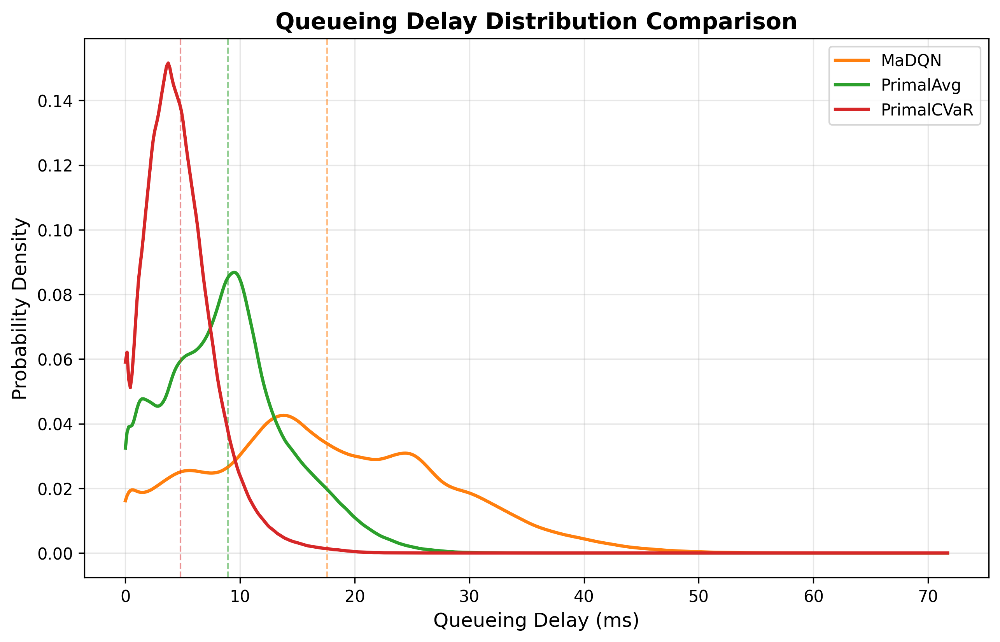</td>
<td>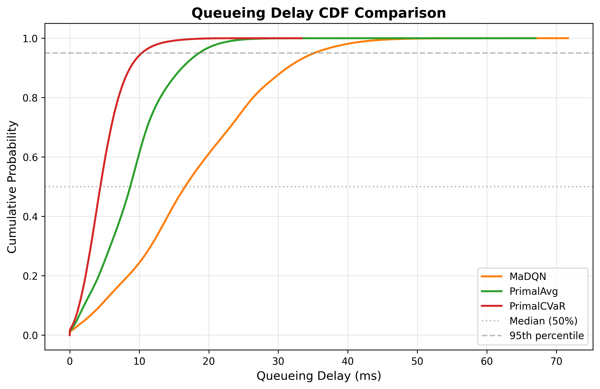</td>
</tr>
<tr>
<td align="center"><b>Probability Density</b></td>
<td align="center"><b>Cumulative Distribution</b></td>
</tr>
</table>

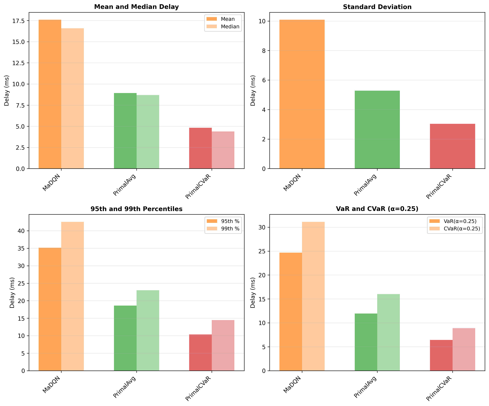
*Statistical summary showing reduced tail latency with risk-aware routing*

### Summary

| Algorithm | Throughput | Drop Rate | E2E Delay | Queuing Delay | CVaR₀.₂₅ | Violation Rate |
|-----------|------------|-----------|-----------|---------------|----------|----------------|
| SPF | 27.0 Mbps | 84.8% | 62.0±85.0ms | 17.5±80.2ms | 70.1ms | 85.7% |
| MADQN | 542.7 Mbps | 0.00% | 73.4±20.4ms | 17.6±10.1ms | 31.1ms | 75.5% |
| PRIMAL-Avg | 542.9 Mbps | 0.00% | 64.6±17.7ms | 8.9±5.3ms | 16.0ms | 38.6% |
| **PRIMAL-CVaR** | **543.0 Mbps** | **0.00%** | **61.5±18.2ms** | **4.8±3.0ms** | **8.9ms** | **5.8%** |

**Key Achievements:**
- 🎯 **70% reduction** in queuing delay vs MADQN (from 17.6ms to 4.8ms)
- ⚡ **12ms lower** end-to-end delay compared to risk-oblivious MADQN
- 📈 **46% reduction** in queuing delay compared to risk-myopic PRIMAL-Avg
- 🔄 **Only 5.8%** constraint violation (queueing delay > 10ms) rate (vs 75.5% for MADQN and 38.6% to PRIMAL-Avg)

## 🛰️ Network Specifications in Simulation

### Constellation Configuration (Walker-Delta)
- **Satellites**: 1584 (22 satellites/orbit × 72 orbits)
- **Altitude**: 600 km
- **Inclination**: 53°
- **Minimum Elevation Angle**: 15°
- **Topology Update**: Every 100ms

### Communication Links
- **Inter-Satellite Links (ISLs)**: 50 Mbps (FSO Laser). We use this value so that small traffic arrival rate could cause significant congestions. 
- **Ground-to-Satellite Links (GSLs)**: 1000 Mbps (Ka-Band)
- **Buffer Size**: 16 Mbits (node and link)
- **Maximum TTL**: 64 hops

### Traffic Model
- **Packet Rate**: 10,000 packets/second (Poisson process)
- **Normal Packets**: 64.8 Kbits (80%)
- **Small Packets**: 16.2 Kbits (20%)
- **Ground Stations**: Luxembourg, Dubai, Beijing


## 📄 License

This project is licensed under the MIT License - see the [LICENSE](LICENSE) file for details.

