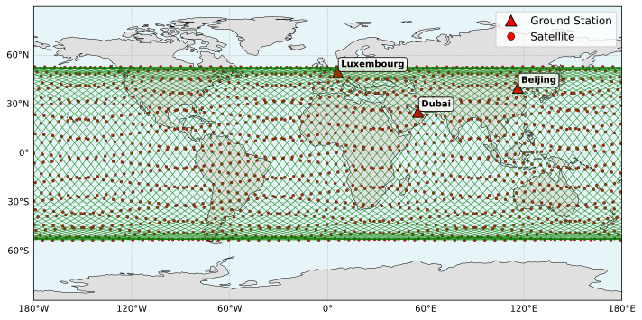

# Asynchronous Risk-Aware Multi-Agent Packet Routing for Ultra-Dense LEO Satellite Networks

[](https://www.python.org/downloads/release/python-3110/)
[](https://opensource.org/licenses/MIT)
[](https://[arxiv.org/abs/2510.27506](https://arxiv.org/abs/2510.27506))

> **Official implementation** of the preprint paper: "Asynchronous Risk-Aware Multi-Agent Packet Routing for Ultra-Dense LEO Satellite Networks"
>
> **Authors**: Ke He, Thang X. Vu, Le He, Lisheng Fan, Symeon Chatzinotas, and Björn Ottersten
>
> 📄 **[Read Paper (PDF)](https://arxiv.org/abs/2510.27506)**



## 🌟 Overview

This repository presents **PRIMAL** (Principled Risk-aware Independent Multi-Agent Learning), a risk-aware multi-agent routing framework for ultra-dense LEO satellite networks. The current simulator targets the first shell of Starlink scale (1584 satellites), dynamic topology, region-based terrestrial traffic, and propagation/queueing delay modeling.

### Slot-Array Simulator

The simulator has been refactored from an event-queue packet model into a data-oriented slot-array kernel:

1. **Region traffic**: Flowlets are sampled from population/region weights and bind to the currently visible access satellite.
2. **Flowlet batches**: A flowlet represents a batch of packets with common source/target regions.
3. **Array network state**: Satellite positions, neighbor/link matrices, link delays, connectivity, queues, and flowlet state are stored in NumPy arrays.
4. **Mask-first slot kernels**: `sat_net/sim_kernel.py` owns flowlet/link state transitions and returns full-length masks before NumPy compression.
5. **Batched policy API**: Solvers receive `RoutingBatch` arrays and return vectorized `RoutingDecision` next hops.
6. **SPF baseline**: Shortest-path next-hop rows are computed from sparse arrays, cached in a dense matrix, and refreshed with topology updates.
7. **Torch RL on NumPy kernels**: The default path is NumPy/SciPy simulation plus PyTorch MaDQN/PRIMAL training.

### 📊 Key Results

- **70% reduction** in queuing delay (i.e. network congestion) compared to risk-oblivious baselines
- **12ms improvement** in end-to-end delay under loaded scenarios
- **5.8% CVaR violation rate** vs 75.5% for traditional approaches
- Simulates global region-to-region traffic over a dense network of **1584 satellites**

### Technical Development

Our PRIMAL framework resolves the fundamental conflict between shortest-path routing and congestion avoidance through:
- **Data-oriented simulation**: Routing, queues, topology updates, and flowlet state are represented as arrays
- **Primal-dual optimization**: Principled constraint handling without manual reward engineering to avoid reward-hacking
- **Implicit Quantile Networks**: Capture full distribution of routing outcomes
- **CVaR constraints**: Direct control over worst-case performance degradation

## 📋 Requirements

### System Requirements
- Python 3.11+
- 32GB RAM recommended for large Starlink-scale runs
- Ubuntu 20.04+ / Windows 10+ / macOS 12+

### Installation

```bash
# Clone the repository
git clone https://github.com/skypitcher/risk_aware_marl.git
cd risk_aware_marl

# Create conda environment
conda create -n risk_aware_routing python=3.11
conda activate risk_aware_routing

# Install dependencies
pip install -r requirements.txt
```

#### Troubleshooting

<details>
<summary>Cartopy installation issues</summary>

On some systems, Cartopy may require additional dependencies:
```bash
# Ubuntu/Debian
sudo apt-get install libproj-dev proj-data proj-bin libgeos-dev

# macOS
brew install proj geos
```
</details>

## 🧠 Routing Policies

- **SPF**: Dijkstra shortest-path first, backed by dense satellite next-hop rows and region-to-next-hop tables.
- **Batched policy contract**: `sat_net/solver/base_solver.py` defines `RoutingBatch` and `RoutingDecision`.
- **RL solvers**: MaDQN, PRIMAL-Avg, and PRIMAL-CVaR have been rebuilt for batched routing with PyTorch replay buffers. MaIQN/MaSAC remain retired until they are ported to the same interface.

## 📁 Project Structure

```
risk_aware_marl/
├── sat_net/                    # Core simulation framework
│   ├── routing_env.py          # Slot-array routing environment
│   ├── sim_kernel.py           # Flowlet/link array transition kernels
│   ├── network.py              # Array-oriented satellite network topology
│   ├── traffic_region.py       # Region/population traffic model
│   └── solver/                 # Batched routing policy API
│       ├── base_solver.py      # RoutingBatch/RoutingDecision contract
│       └── spf.py              # Shortest-path baseline
├── configs/                    # Configuration files
│   ├── starlink_dvbs2_*.json  # Network configurations
│   └── spf.json                # Solver configuration
├── figs/                       # Figures and plots
└── runs_*/                     # Experiment results
```

## 🚀 Quick Start

### SPF Baseline

```bash
# Generate SPF baseline results
python run_spf.py

# Evaluate SPF across seeds
python run_eval.py
```

### RL Training Status

`run_train.py` executes policy rollouts through the batched interface. Use `configs/dqn.json`, `configs/primal_avg.json`, or `configs/primal_cvar.json` to train the rebuilt MaDQN/PRIMAL baselines.

## 📄 License

This project is licensed under the MIT License - see the [LICENSE](LICENSE) file for details.
