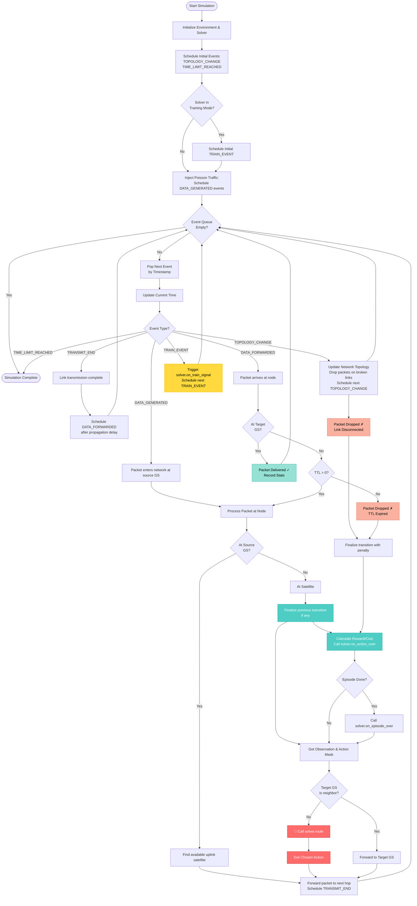

# Asynchronous Risk-Aware Multi-Agent Packet Routing for Ultra-Dense LEO Satellite Networks

[](https://www.python.org/downloads/release/python-3110/)
[](https://opensource.org/licenses/MIT)
[](https://[arxiv.org/abs/2510.27506](https://arxiv.org/abs/2510.27506))
[](https://pytorch.org/)

> **Official implementation** of the preprint paper: "Asynchronous Risk-Aware Multi-Agent Packet Routing for Ultra-Dense LEO Satellite Networks"
>
> **Authors**: Ke He, Thang X. Vu, Le He, Lisheng Fan, Symeon Chatzinotas, and Björn Ottersten
>
> 📄 **[Read Paper (PDF)](https://arxiv.org/abs/2510.27506)**


## 🌟 Overview

This repository presents **PRIMAL** (Principled Risk-aware Independent Multi-Agent Learning), a novel multi-agent deep reinforcement learning framework for packet routing in ultra-dense LEO satellite networks. Our approach addresses the unique challenges of massive scale (1584 satellites, i.e., the first shell of Starlink), dynamic topology, and significant propagation delays inherent in next-generation mega-constellations.

This codebase contains a light-weight even-driven simulator for LEO satellite communications used as the environment for offline training of RL agents, i.e., Multi-agent deep reinforcement learning based networking in ultra-dense LEO satellite networks.

### 🔄 Event-Driven Simulator with Native RL Integration

Our simulator seamlessly integrates deep RL training into an event-driven network simulation without artificial episode boundaries. Here's how it works:


```mermaid
flowchart TD
    Start([Start Simulation]) --> Init[Initialize Environment & Solver]
    Init --> ScheduleInit[Schedule Initial Events:<br/>TOPOLOGY_CHANGE<br/>TIME_LIMIT_REACHED]
    
    ScheduleInit --> CheckTrainMode{Solver in<br/>Training Mode?}
    CheckTrainMode -->|Yes| ScheduleTrain[Schedule Initial TRAIN_EVENT]
    CheckTrainMode -->|No| Traffic
    ScheduleTrain --> Traffic
    Traffic[Inject Poisson Traffic:<br/>Schedule DATA_GENERATED events] --> Loop{Event Queue<br/>Empty?}
    
    Loop -->|No| PopEvent[Pop Next Event<br/>by Timestamp]
    Loop -->|Yes| End([Simulation Complete])
    
    PopEvent --> UpdateTime[Update Current Time]
    UpdateTime --> EventType{Event Type?}
    
    %% Event Type Handlers
    EventType -->|TIME_LIMIT_REACHED| End
    EventType -->|TOPOLOGY_CHANGE| TopoHandler[Update Network Topology<br/>Drop packets on broken links<br/>Schedule next TOPOLOGY_CHANGE]
    EventType -->|DATA_GENERATED| DataGenHandler[Packet enters network at source GS]
    EventType -->|TRANSMIT_END| TransmitHandler[Link transmission complete]
    EventType -->|DATA_FORWARDED| ForwardHandler[Packet arrives at node]
    EventType -->|TRAIN_EVENT| TrainHandler[Trigger solver.on_train_signal<br/>Schedule next TRAIN_EVENT]
    
    TopoHandler --> Loop
    TrainHandler --> Loop
    
    %% Data Processing Flow
    DataGenHandler --> ProcessPacket[Process Packet at Node]
    
    TransmitHandler --> Propagate[Schedule DATA_FORWARDED<br/>after propagation delay]
    Propagate --> Loop
    
    ForwardHandler --> CheckDest{At Target<br/>GS?}
    CheckDest -->|Yes| Delivered[Packet Delivered ✓<br/>Record Stats]
    CheckDest -->|No| CheckTTL{TTL > 0?}
    CheckTTL -->|No| Dropped[Packet Dropped ✗<br/>TTL Expired]
    CheckTTL -->|Yes| ProcessPacket
    
    Delivered --> Loop
    
    TopoHandler --> DroppedLink[Packet Dropped ✗<br/>Link Disconnected]
    DroppedLink --> FinalizeDropped
    Dropped --> FinalizeDropped
    
    %% RL Integration & Routing Logic
    ProcessPacket --> AtSourceGS{At Source<br/>GS?}
    AtSourceGS --> |Yes| FindUplink[Find available uplink satellite]
    FindUplink --> Forward[Forward packet to next hop<br/>Schedule TRANSMIT_END]
    AtSourceGS --> |No| AtSatellite[At Satellite]

    AtSatellite --> Finalize[Finalize previous transition<br/>if any]
    Finalize --> GetObs[Get Observation & Action Mask]
    
    GetObs --> CheckDirectLink{Target GS<br/>is neighbor?}
    CheckDirectLink --> |No| RLRoute[🤖 Call solver.route]
    RLRoute --> ChosenAction[Get Chosen Action]
    ChosenAction --> Forward

    CheckDirectLink --> |Yes| ForwardToGS[Forward to Target GS]
    ForwardToGS --> Forward

    Forward --> Loop
    
    %% Experience and Episode Termination
    Finalize --> StoreExperience[Calculate Reward/Cost<br/>Call solver.on_action_over]
    StoreExperience --> CheckDone{Episode Done?}
    CheckDone --> |Yes| OnEpisodeOver[Call solver.on_episode_over]
    CheckDone --> |No| GetObs
    OnEpisodeOver --> GetObs

    FinalizeDropped[Finalize transition with penalty] --> StoreExperience
    
    style RLRoute fill:#ff6b6b,stroke:#c92a2a,color:#fff
    style ChosenAction fill:#ff6b6b,stroke:#c92a2a,color:#fff
    style Finalize fill:#4ecdc4,stroke:#0ca49c,color:#fff
    style StoreExperience fill:#4ecdc4,stroke:#0ca49c,color:#fff
    style TrainHandler fill:#ffd93d,stroke:#f8b500,color:#000
    style Delivered fill:#95e1d3,stroke:#38ada9,color:#000
    style Dropped fill:#fab1a0,stroke:#e17055,color:#000
    style DroppedLink fill:#fab1a0,stroke:#e17055,color:#000
```

**Key Features:**

1. **🎯 Asynchronous Episodes**: Each packet forms its own episode with variable length (until delivery or drop)
2. **⚡ Event-Driven Execution**: All actions (routing decisions, transmissions, topology changes) are scheduled as timestamped events
3. **🔗 Seamless RL Integration**: 
   - `solver.route(obs, info)` → Policy makes routing decisions
   - `on_action_over(packet)` → Store experience in replay buffer when transition completes
   - `on_episode_over(packet)` → Episode termination when packet delivered/dropped
   - `on_train_signal()` → Periodic training triggered by TRAIN_EVENT (every 100ms by default)
4. **⏱️ Realistic Delays**: Queueing, transmission, and propagation delays naturally emerge from the simulation rather than 1ms artifical stepsize

### 📊 Key Results

- **70% reduction** in queuing delay (i.e. network congestion) compared to risk-oblivious baselines
- **12ms improvement** in end-to-end delay under loaded scenarios
- **5.8% CVaR violation rate** vs 75.5% for traditional approaches
- Successfully manages routing in a dense network of **1584 satellites** and **3 ground stations**

### Technical Development

Our PRIMAL framework resolves the fundamental conflict between shortest-path routing and congestion avoidance through:
- **Event-driven design**: Each satellite acts independently on its own timeline
- **Primal-dual optimization**: Principled constraint handling without manual reward engineering to avoid reward-hacking
- **Implicit Quantile Networks**: Capture full distribution of routing outcomes
- **CVaR constraints**: Direct control over worst-case performance degradation

## 📋 Requirements

### System Requirements
- Python 3.11+
- CUDA 11.8+ (for GPU acceleration)
- 32GB RAM (recommended for training)
- Ubuntu 20.04+ / Windows 10+ / macOS 12+

### Installation

```bash
# Clone the repository
git clone https://github.com/skypitcher/risk_aware_marl.git
cd risk_aware_marl

# Create conda environment
conda create -n risk_aware_routing python=3.11
conda activate risk_aware_routing

# Install dependencies
pip install -r requirements.txt
```

#### Troubleshooting

<details>
<summary>CUDA/PyTorch issues</summary>

If you encounter CUDA compatibility issues:
```bash
# For CUDA 11.8
pip install torch torchvision torchaudio --index-url https://download.pytorch.org/whl/cu118

# For CUDA 12.1
pip install torch torchvision torchaudio --index-url https://download.pytorch.org/whl/cu121
```
</details>

<details>
<summary>Cartopy installation issues</summary>

On some systems, Cartopy may require additional dependencies:
```bash
# Ubuntu/Debian
sudo apt-get install libproj-dev proj-data proj-bin libgeos-dev

# macOS
brew install proj geos
```
</details>

## 🧠 Implemented Algorithms

### Our Contributions (PRIMAL Framework)
- **PRIMAL-CVaR** 🎯: Risk-aware routing with CVaR constraints at configurable risk levels (e.g., ε=0.25)
  - Learns full cost distribution via Implicit Quantile Networks
  - Directly constrains tail-end risks for robust performance
- **PRIMAL-Avg** 📊: Risk-neutral variant with expectation-based constraints
  - Optimizes average performance with primal-dual learning
  - Serves as ablation study for risk-awareness benefits

### Baseline Methods
- **SPF**: Dijkstra's Shortest Path First - Precomputed routing based on predictable orbital movements
- **MADQN**: Multi-agent asynchronous DQN with heuristic reward shaping [Lozano-Cuadra et al., 2025]
- **MaIQN**: Multi-agent Implicit Quantile Network (distributional but risk-oblivious)
- **MaSAC**: Multi-agent Soft Actor-Critic with maximum entropy

## 📁 Project Structure

```
risk_aware_marl/
├── sat_net/                    # Core simulation framework
│   ├── routing_env.py          # Async routing environment
│   ├── network.py              # Satellite network topology
│   ├── node.py                 # Satellite/ground station nodes
│   ├── link.py                 # Communication links
│   ├── event.py                # Event-driven scheduler
│   └── solver/                 # Routing algorithms
│       ├── primal_cvar.py      # Our risk-aware algorithm
│       ├── primal_avg.py       # Our risk-neutral algorithm
│       ├── dqn.py              # DQN baseline
│       └── spf.py              # Traditional routing
├── satnet_viewer/              # 2D visualization tool
│   ├── app.py                  # ImGui application
│   └── renderer.py             # OpenGL rendering
├── configs/                    # Configuration files
│   ├── starlink_dvbs2_*.json  # Network configurations
│   └── *.json                  # Algorithm hyperparameters
├── saved_models/               # Pre-trained models
├── figs/                       # Figures and plots
└── runs_*/                     # Experiment results

## 🚀 Quick Start

### Using Pre-trained Models

We provide pre-trained models in the `saved_models/` directory for immediate evaluation:

```bash
# Evaluate all algorithms with pre-trained models
python run_eval.py

# Generate SPF baseline results
python run_spf.py
```

### Training from Scratch

#### Single Algorithm Training
```bash
# Train Primal-CVaR (our risk-aware algorithm)
python run_train.py --solver=configs/primal_cvar.json

# Train Primal-Avg (our risk-neutral algorithm)
python run_train.py --solver=configs/primal_avg.json

# Train baseline algorithms
python run_train.py --solver=configs/dqn.json
python run_train.py --solver=configs/iqn.json
python run_train.py --solver=configs/sac.json
```

#### Distributed Training (SLURM)
```bash
# Submit training jobs to SLURM cluster
sbatch train_primal_cvar.sh
sbatch train_primal_avg.sh
sbatch train_madqn.sh
```

#### Custom Configuration
```json
// Example: configs/primal_cvar.json
{
  "risk_level": 0.25,      // CVaR risk level (0.25 = worst 25% of outcomes)
  "cost_limit": 10,        // Maximum queuing delay threshold (ms)
  "discount_reward": 0.99, // Reward discount factor
  "discount_cost": 0.97,   // Cost discount factor (lower = more myopic)
  "hidden_dim": 512,       // Neural network hidden layer size
  "num_quantiles": 64,     // Number of quantiles for IQN
  "batch_size": 2048,      // Training batch size
  "buffer_size": 300000,   // Experience replay buffer size
  "learning_rate": 1e-4
}
```

## 📄 License

This project is licensed under the MIT License - see the [LICENSE](LICENSE) file for details.

